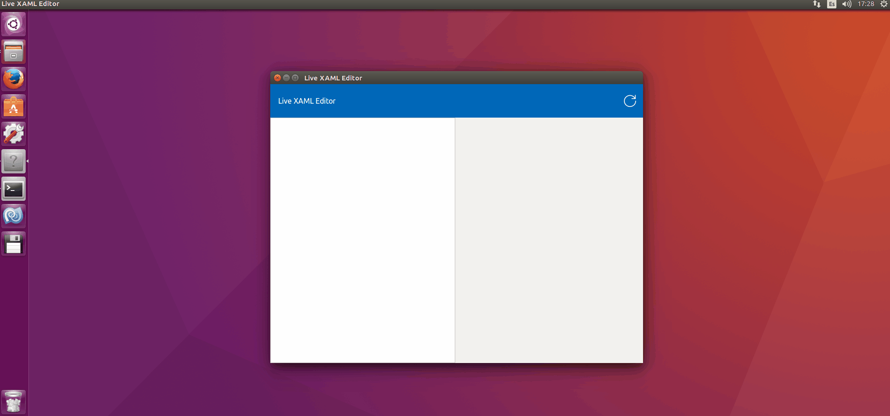
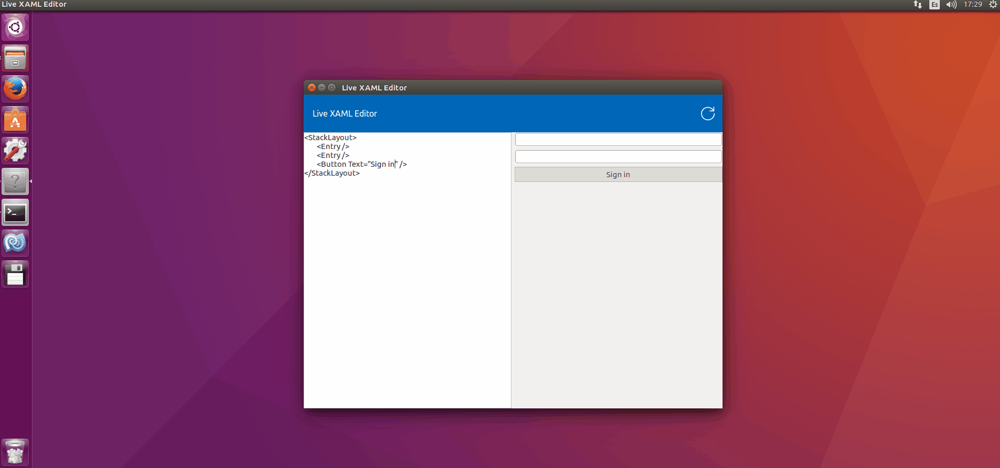
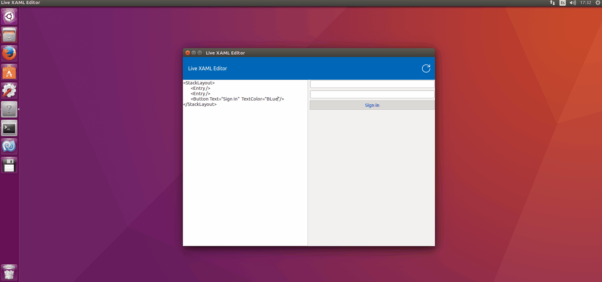
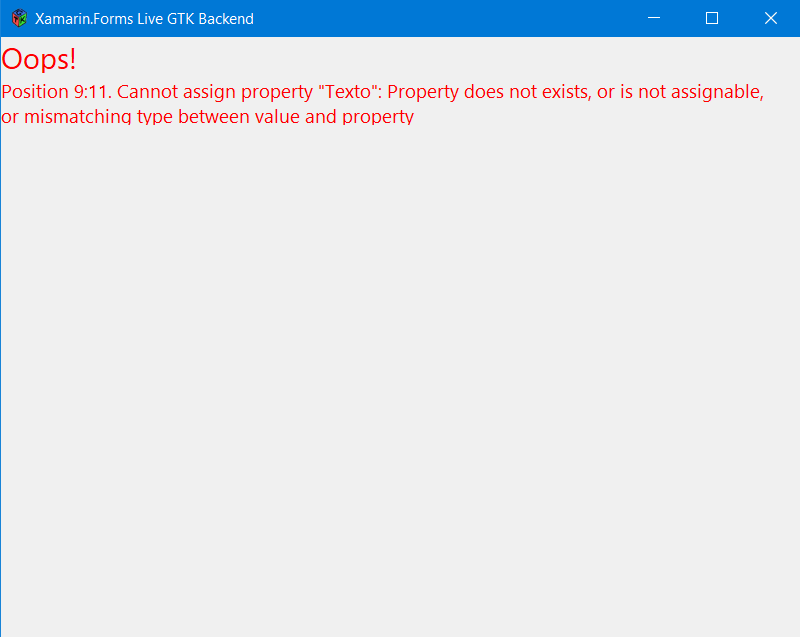

# FormsGtkLive

**Live XAML** development for Xamarin Forms Apps using Gtk Backend.

    

***NOTE**: Work in progress!*

## Setup

Clone this repository. Open the solution in **FormsGtkLive.sln** with Visual Studio and press F7.

## Usage

To live develop XAML you open the **FormsGtkLive** tool. Any XAML file included in the same folder as the  tool will be previewed.

The tool can also detect XAML markup **errors**.

## Feedback 

Please use [GitHub issues](https://github.com/jsuarezruiz/FormsGtkLive/issues) for questions, comments, feature requests, or if would like to vote on what others are recommending.

## License

Code released under the [MIT license](https://opensource.org/licenses/MIT).